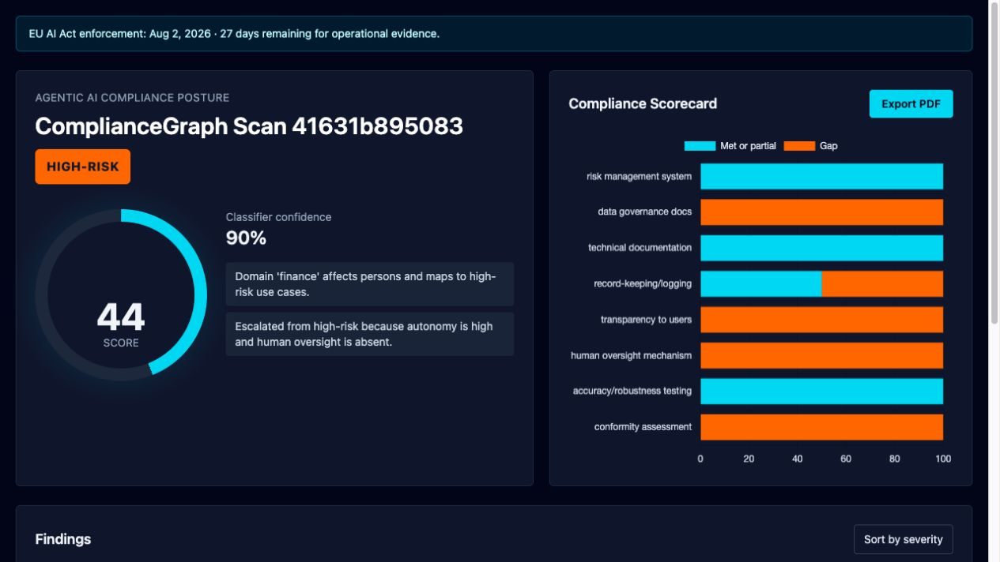

# ComplianceGraph

EU AI Act enforcement is close: ComplianceGraph turns agentic AI security scans into risk tiers, gap analysis, and audit-ready PDF evidence.



Live demo: pending Render deployment.

## Quickstart

```bash
git clone https://github.com/dhruboshop/ComplianceGraph.git
cd ComplianceGraph
python3.11 -m venv venv
source venv/bin/activate
pip install -r requirements.txt
uvicorn app.main:app --reload
```

Open `http://localhost:8000/dashboard/test` for a sample dashboard.

## CLI

```bash
python cli.py scan --input tests/fixtures/high_risk_sample.json --domain finance --autonomy high --oversight false
```

The CLI writes a dashboard HTML file and PDF report to `./reports/`.

## API

- `GET /` health check
- `POST /scan` classify and store a scan
- `GET /dashboard/{scan_id}` render the dashboard
- `GET /report/{scan_id}/pdf` download the audit report

## License

MIT
